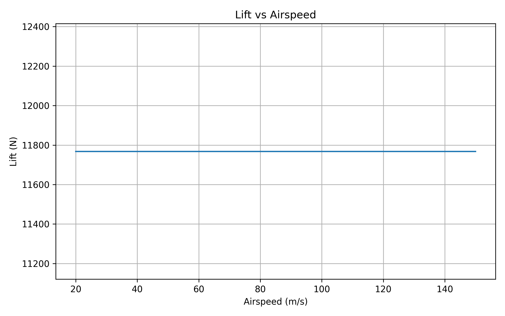
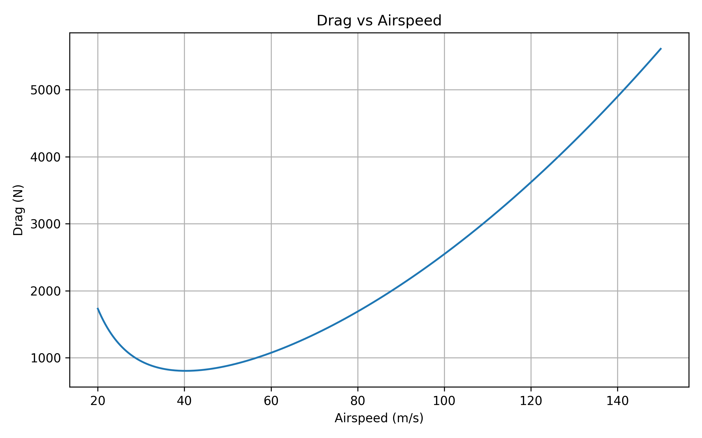
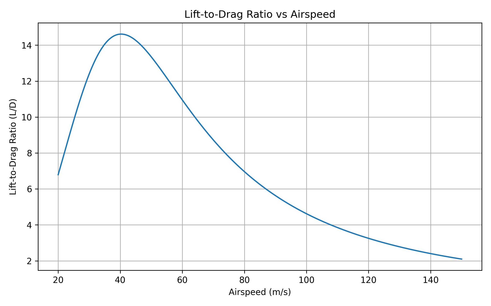
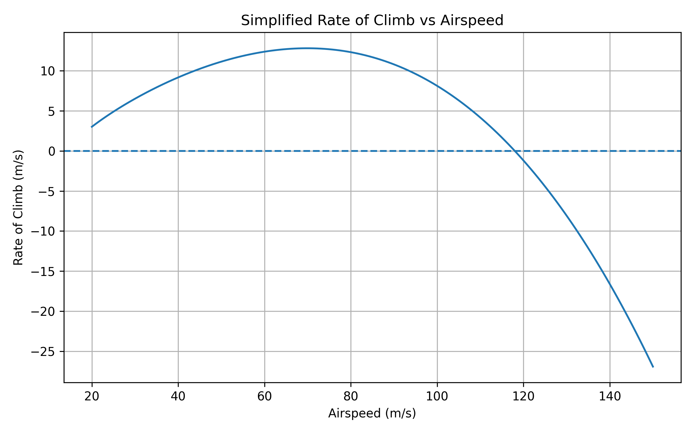

# Aircraft Performance Analysis

A Python-based computational study of fundamental aircraft performance and aerodynamic characteristics using simplified flight-mechanics models.

## Overview

This project develops an educational computational model for analysing basic aircraft performance using Python, NumPy, and Matplotlib.

The model evaluates:

- Aircraft weight
- Induced drag factor
- Stall speed
- Thrust-to-weight ratio
- Lift
- Drag
- Lift-to-drag ratio (L/D)
- Simplified rate of climb
- Performance trends with airspeed

The project is designed as a foundation for further studies in aerodynamics, aircraft performance, flight mechanics, and aerospace engineering.

## Objectives

The primary objectives are to:

1. Implement fundamental aircraft-performance equations in Python.
2. Calculate important aerodynamic and performance parameters.
3. Study the relationship between airspeed and aerodynamic forces.
4. Visualize lift, drag, L/D ratio, and climb-performance trends.
5. Build a reproducible computational framework for future aerospace research projects.

## Aircraft Model

The current baseline model uses the following representative aircraft parameters:

| Parameter | Value | Unit |
|---|---:|---|
| Mass | 1200 | kg |
| Wing area | 16.2 | m² |
| Aspect ratio | 8.5 | - |
| Oswald efficiency | 0.80 | - |
| Zero-lift drag coefficient | 0.025 | - |
| Maximum lift coefficient | 1.60 | - |
| Available thrust | 3500 | N |
| Air density | 1.225 | kg/m³ |
| Gravitational acceleration | 9.80665 | m/s² |

## Methodology

The computational model follows standard simplified aerodynamic relationships.

### Aircraft Weight

The aircraft weight is calculated from:

\[
W = mg
\]

where:

- \(W\) = aircraft weight
- \(m\) = aircraft mass
- \(g\) = gravitational acceleration

### Induced Drag Factor

The induced drag factor is estimated using:

\[
k = \frac{1}{\pi e AR}
\]

where:

- \(e\) = Oswald efficiency factor
- \(AR\) = wing aspect ratio

### Stall Speed

The simplified stall speed is calculated using:

\[
V_s =
\sqrt{\frac{2W}{\rho S C_{Lmax}}}
\]

where:

- \(V_s\) = stall speed
- \(W\) = aircraft weight
- \(\rho\) = air density
- \(S\) = wing area
- \(C_{Lmax}\) = maximum lift coefficient

### Lift Coefficient

For the simplified steady-level-flight condition:

\[
C_L =
\frac{W}{qS}
\]

where dynamic pressure is:

\[
q = \frac{1}{2}\rho V^2
\]

### Drag Coefficient

The simplified drag-polar model is:

\[
C_D = C_{D0} + kC_L^2
\]

### Aerodynamic Forces

Lift:

\[
L = qSC_L
\]

Drag:

\[
D = qSC_D
\]

### Lift-to-Drag Ratio

\[
\frac{L}{D} = \frac{L}{D}
\]

### Simplified Rate of Climb

The model estimates rate of climb using:

\[
ROC =
\frac{(T-D)V}{W}
\]

where:

- \(T\) = available thrust
- \(D\) = aerodynamic drag
- \(V\) = airspeed

## Computational Results

Using the baseline parameters, the model produces approximately:

| Result | Value |
|---|---:|
| Aircraft mass | 1200 kg |
| Aircraft weight | 11767.98 N |
| Induced drag factor | 0.046810 |
| Stall speed | 27.23 m/s |
| Stall speed | 98.01 km/h |
| Thrust-to-weight ratio | 0.297 |

These values are generated computationally from the baseline assumptions and are intended for educational and research-development purposes.

## Performance Visualizations

### Lift vs Airspeed



### Drag vs Airspeed



### Lift-to-Drag Ratio vs Airspeed



### Simplified Rate of Climb vs Airspeed



## Project Structure

```text
aircraft-performance-analysis/
│
├── data/
│
├── results/
│   └── figures/
│       ├── lift_vs_airspeed.png
│       ├── drag_vs_airspeed.png
│       ├── lift_to_drag_vs_airspeed.png
│       └── rate_of_climb_vs_airspeed.png
│
├── src/
│   └── aircraft_performance.py
│
├── README.md
└── requirements.txt
